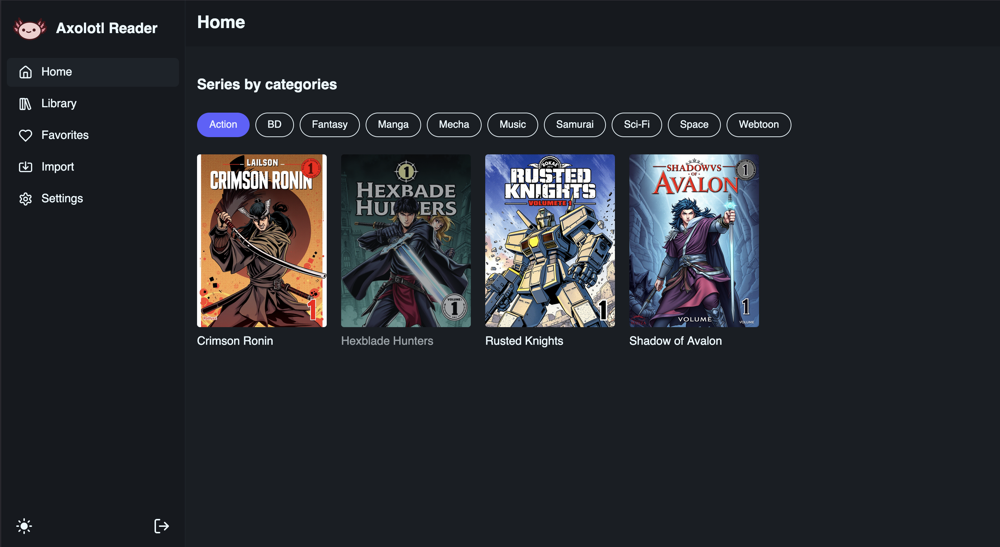
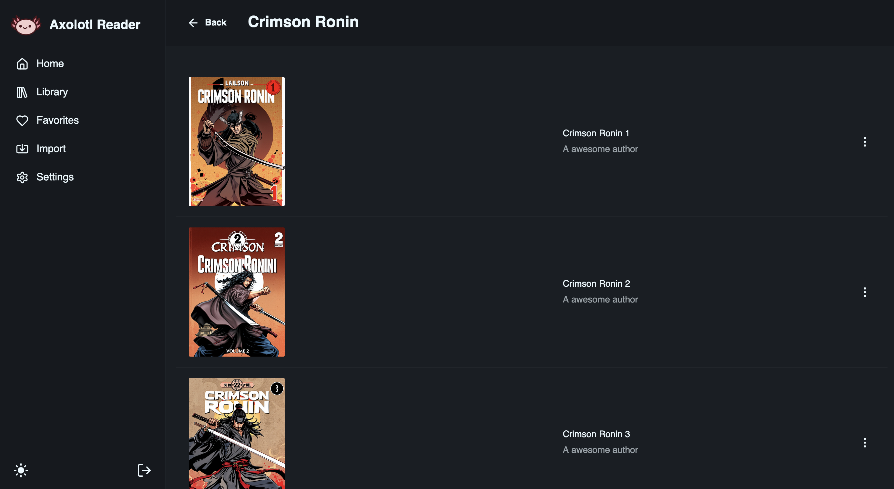
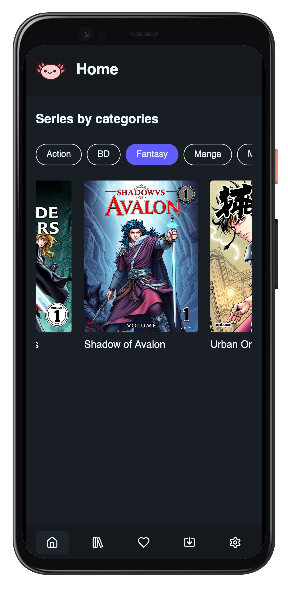
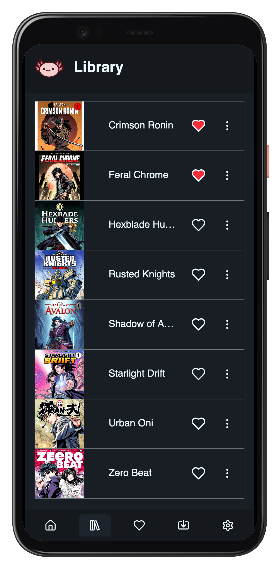

<p align="center">
  
</p>

<h1 align="center">Axolotl Reader</h1>

**Axolotl Reader** is a self-hosted web app to organize, browse, and read your comics, manga, or manhwa collection.

[](https://github.com/users/bastien2203/packages/container/package/axolotl-reader)


## Screenshots

<p align="center">
  
    
</p>

<p align="center">
  
  
</p>


## Getting started

Create directories that will be used to store the database and the books:

```sh
mkdir -p data/books
mkdir data/covers
touch data/comics.db
```


Create a `.env` file in the root of the project with the following content:

```sh
# JWT secret used to sign the JWT token (change it to something else)
JWT_TOKEN=your_jwt_secret

# The host of your APP
API_HOST=https://axolotl.bastiengrisvard.com

# Directory in the container where books, covers and database will be stored
BOOK_DIRECTORY=data 
COVER_DIRECTORY=covers
DATABASE_PATH=comics.db

# Environment variables
ENV=production
GIN_MODE=release
```


Run the lastest version of the docker image:

```sh
docker run -d \
  --env-file .env \
  -p 8888:8080 \
  -v $(pwd)/data/comics.db:/app/comics.db \
  -v $(pwd)/data/books:/app/data \
  -v $(pwd)/data/covers:/app/covers \
  --restart always \
  --name axolotl-reader \
  ghcr.io/bastien2203/axolotl-reader:latest
```


## Tech stack

This project is split into two folders:  
`api/` for the Go backend  


<br>

`app/` for the React frontend


## Development

// TODO : Add a real dev environment

```sh
mkdir -p api/data
mkdir api/covers
touch api/comics.db
```

### Backend (Go + Gin + Gorm + Sqlite)

- Go 1.23.0
- Sqlite 3

```sh
cd api
go mod tidy
go run main.go
```

### Frontend (React + TS + Vite)

- Node >=22.15.0

```sh
cd app
npm install
npm run dev
```


---

## TODO

### Backend
- [ ] Remove facets route when frontend finished removing the usage
- [ ] Add reading progress in the API (should be also available offline in the app)
- [ ] Currently series cover is the first book cover, we should add a dedicated field for it
- [ ] Add Bulk import for series
- [ ] Currently its possible to add a book that is not part of a series, do we want to keep this ? (it needs to be fixed in the frontend too)
- [ ] When registering book cover convert it to webp
- [ ] Convert all images in cbz to webp ?


### Frontend
- [ ] Add delete modal for series
- [ ] Refacto ImportBook :
  - Instead of using facets routes, get all tags/seriesNames/authors from the REST Api routes 
  - Use a bulk post instead of a post for each book

- [ ] Fix the PWA (doesnt work offline for now)
- [ ] Add possibility download a book (or an entire series) in the app
- [ ] Add pagination in `<SeriesTable />`

### Ops
- [ ] Remove JWT_TOKEN env var from Dockerfile and get it from docker run 
- [ ] Build time for arm64 is too long 
- [ ] Add tags for release 


## License

MIT © 2025 [Bastien Grisvard](https://github.com/bastien2203)
